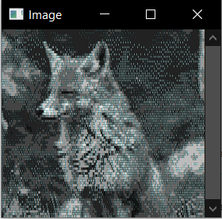
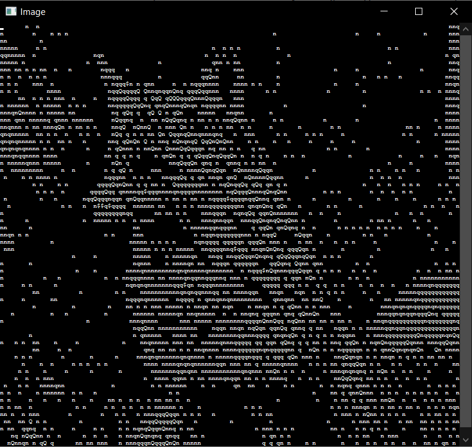
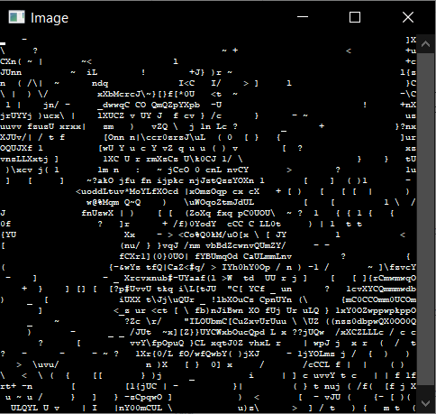
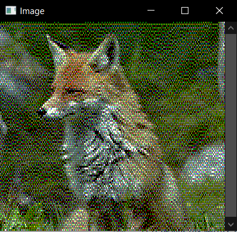
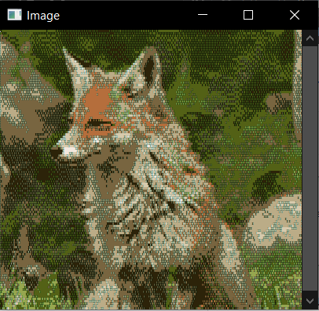

# Console Image Display

## Table of Contents
* [General Info](#general-info)
* [Features](#features)
* [Usage](#usage)
* [Examples](#examples)
* [How it works](#how-it-works)
* [Launch](#launch)

## General Info
An command line application that allows images to be displayed within the windows command prompt. This project was created to demonstrate the progression of my coding practices and ability.

## Features
### Image and font scaling

### Pixel and ascii viewing

### Multiple coloring algorithms

### User-selected color sets


## Usage
See [Launch](#launch) for setup instructions.

     *.exe "IMAGE" [OPTION]...


##### Options:
```
     -fs n              (Font size) [default: 1]
                        Displays the image in font size 'n'
```
```
     -sf n              (Scale factor) [default: 1.0]
                        Scale the image by 'n'
```
```
     -it [p|a|r]        (Image type) [default: p]
                        Changes the characters used to display the image

                        [p: pixel (ascii 219)]
                        [a: ascii]
                        [r: ascii (reduced characters)]
```
```
     -am [pre|post]     (Ascii mode) [default: pre]
                        Changes whether ascii characters are assigned before or
                        after image processing

                        [pre: pre-process]
                        [post: post-process]

                        NOTE: this option is ignored if the image type is pixel
```
```
     -cm [a|f|n]        (Color mode) [default: a]
                        Changes the algorithm used to process the image

                        [a: atkinson dithering]
                        [f: floyd-steinberg dithering]
                        [n: nearest value]
```
```
     -ic ["FILE"|$*]    (Image colors) [default: $default]
                        Choose the set of colors the image processing is
                        applied with
						
						["FILE": path to file containing colors]
                        [$*: predefined color sets]
                                -$grey: 16 shades of grey
                                -$default: default command prompt colors
                                -$bw: black and white
                                -$approx(n): n approximate colors
								
                        NOTE: colors specified in a file should be delimited
                        by new lines with r,g,b elements delimited by commas

                        
```
```
     -tc ["FILE"|$*]    (Text colors) [default: $default]
                        Choose the set of colors the text is displayed with

                        ["FILE": path to file containing colors]
                        [$*: predefined color sets]
                                -$grey: 16 shades of grey
                                -$default: default command prompt colors
                                -$bw: black and white
                                -$approx(n): n approximate colors
								
						NOTE: colors specified in a file should be delimited
                        by new lines with r,g,b elements delimited by commas
```
Approximate colors serve the purpose of reducing the total number of unique colors used in the image while preserving as much detail as possible. Use of approximate colors is necessary to reproduce images in the command prompt since only 16 colors are available for use when coloring the image.
###### Help information can be viewed by running the application with no parameters

## Examples
```
ConsoleImageDisplay.exe "fox.jpg" -ic $approx(16) -tc $grey -sf 0.2
```

---
```
ConsoleImageDisplay.exe "fox.jpg" -tc &bw -it a -am post -fs 10 -sf 0.06
```

---
```
ConsoleImageDisplay.exe "fox.jpg" -tc $bw -it a -am pre -fs 10 -sf 0.06
```

---
```
ConsoleImageDisplay.exe "fox.jpg" -ic colors.txt -tc colors.txt -sf 0.3
```
##### colors.txt:
```
0,0,0
255,255,255
255,0,0
0,255,0
0,0,255
255,255,0
255,0,255
0,255,255
```

---
```
ConsoleImageDisplay.exe "fox.jpg" -tc $approx(8) -ic $approx(8) -sf 0.3
```

---

## How it works
#### Writing to the console without stdout
For this project, it is essential to be able to write to the console without using `printf()` or `std::cout`. To accomplish this, you can make use of the WinAPI which includes some functions that allow you to interface directly with a command prompt's text buffer. Using these functions, you are able to modify the size of the buffer, contents of the buffer, font and font size, and color table. Each of these functionalities are demonstrated in the `ConsoleWindow.h` and `ConsoleWindow.cpp` files.
#### Reconstructing the image using 16 colors
The next step for this project is to reduce the total number of colors used by an image to 16 or fewer. This is a very important step because the Windows command prompt only has space for 16 colors in its color table.


To accomplish this, you can take several avenues. The selected solution for this project was to use  and a  to find the 16 best colors to use to faithfully reconstruct the image, however, other options are included as well. Some other options include: displaying the image in greyscale by using 16 shades of grey or mapping a greyscale image pixel value to an ascii character (demonstrated ), dithering the image using an arbitrary color set, or implementing some combination of these two options.
#### Loading the image into the console's text buffer
The last step is to load the image into the console's text buffer. Part of this step requires the rescaling of the image to ensure that it fits within the maximum size of the command prompt window so that the user doesn't need to scroll to see the whole image. Once that is done, the pixel information can be translated into the text buffer fairly easily. This is demonstrated in the `ConsoleImage.h` and `ConsoleImage.cpp` files.

## Launch

* Visual C++ 2017
* [OpenCV 3.4.3](https://opencv.org/releases/page/3/)
* WinAPI

To run this program, download the executable from the bin folder or download the source files from the src folder and compile them with the Visual C++ compiler (found in the Windows SDK). If compiling locally, it is necessary to link opencv_world232.lib and include all of the required header files from the OpenCV download.


#### [back to the top](#table-of-contents)
